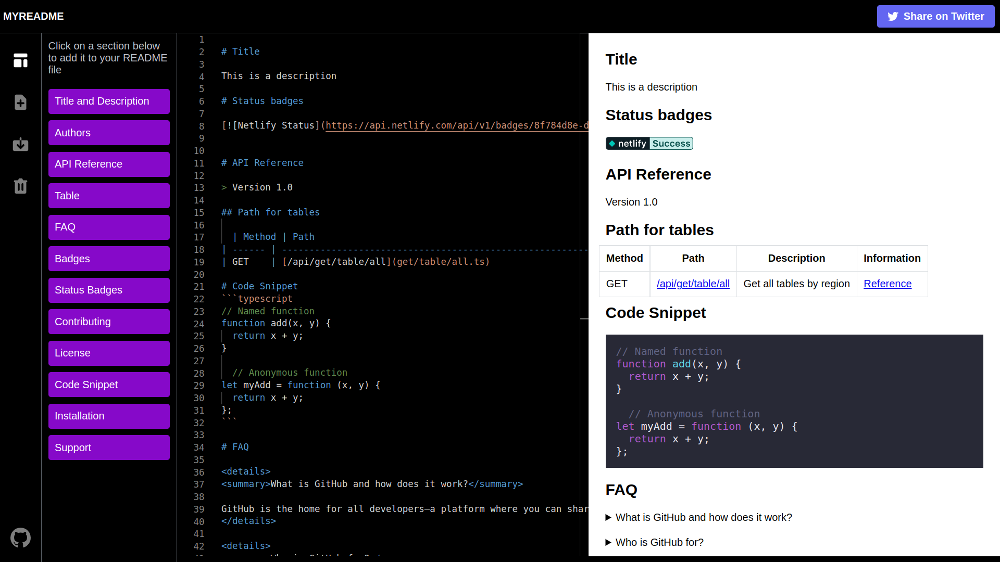

# myreadme

Customize your README.md file with ready-to-use sections in a simple way with the web editor

[](https://app.netlify.com/sites/regal-cassata-00f48d/deploys)




## Docker version

 ```bash
docker run -p 7000:3000 nelsoncode/myreadme:latest
```

## ⚡️ Features
* Search in Editor
* Download README.md file
* Upload README.md file
* Docker version
* Friendly UI
* Dark Mode

### License

MIT License | Nelson Hernández
